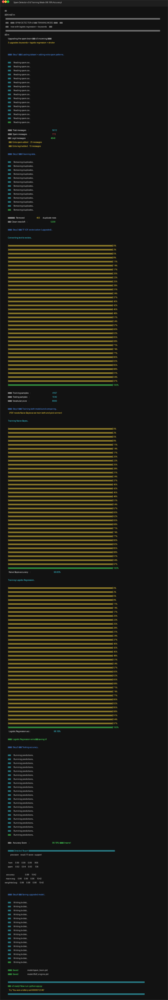
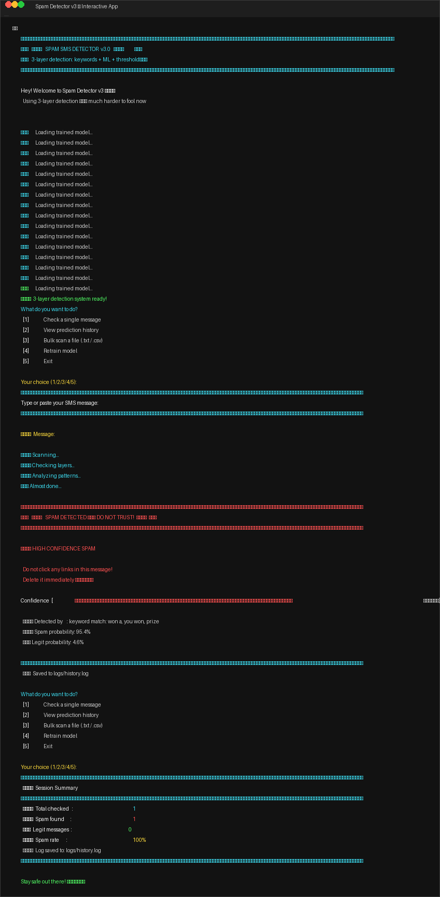
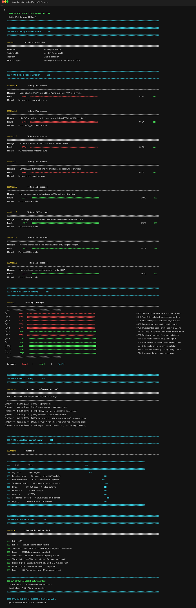

# Spam SMS Detector v3.0

**CodSoft Machine Learning Internship — Task 1**
DEMO LIVE LINK:-https://web-production-643ed.up.railway.app/

A 3-layer spam SMS detection system combining **keyword-based rules**, **logistic regression**, and a **low confidence threshold** to achieve ~98% accuracy.

[Features](#features) · [Screenshots](#screenshots) · [Quick Start](#quick-start) · [Architecture](#architecture) · [Performance](#performance) · [Tech Stack](#tech-stack)

---

## Screenshots

### Training the Model



*Logistic Regression achieves 98.18% accuracy — outperforming Naive Bayes (96.83%)*

### Interactive Detection



*3-layer detection scans messages and displays confidence scores with color-coded results*

### Full Demonstration



*Complete walkthrough: single detection, bulk scan (12 messages), prediction history, and metrics*

---

## Features

- **3-Layer Detection Pipeline**
  - Layer 1: Keyword rules (instant spam flag on 80+ patterns)
  - Layer 2: Logistic Regression ML model (TF-IDF vectorized)
  - Layer 3: Low confidence threshold (flags at 30%+ probability)
- **Interactive CLI** with colored output, loading animations, and progress bars
- **Single message check** — type or paste any SMS
- **Bulk scan** — process entire `.txt` or `.csv` files at once
- **Prediction history** — every scan logged with timestamp + verdict + confidence
- **Session summary** — total checked, spam found, spam rate
- **Retrain on demand** — re-train the model from inside the app
- **Text preprocessing** — normalizes URLs, phone numbers, and money amounts
- **Confidence tiers** — SAFE / SUSPICIOUS / HIGH CONFIDENCE SPAM

---

## Quick Start

### Prerequisites

- Python 3.9+
- pip (Python package manager)

### Setup

```bash
# 1. Clone or download the project
cd spam-detector-v3

# 2. Install dependencies
pip install -r requirements.txt

# 3. Download dataset
```
1. Go to [UCI SMS Spam Collection](https://www.kaggle.com/datasets/uciml/sms-spam-collection-dataset)
2. Download and unzip `spam.csv` into the project folder

```bash
# 4. Train the model
python train.py

# 5. Run the app
python app.py
```

### Dataset Augmentation

The original UCI dataset (~5,572 messages) is augmented with 25 Indian-specific spam patterns and 15 additional legit messages to improve detection of region-specific scams (KYC fraud, lottery calls, fake job offers, etc.).

---

## Architecture

### Project Structure

```
spam-detector-v3/
│
├── app.py                  Main application (CLI + 3-layer detection)
├── train.py                Model training pipeline
├── preprocess.py           Text normalization (URL, phone, money)
├── requirements.txt        Python dependencies
├── spam.csv                Training dataset
├── .gitignore
├── README.md
│
├── model/
│   ├── spam_brain.pkl      Trained classifier
│   └── tfidf_engine.pkl    TF-IDF vectorizer
│
├── logs/
│   └── history.log         Prediction audit trail
│
├── screenshots/            Submission screenshots
│
└── tools/
    ├── demo.py             Automated feature demo
    └── generate_screenshots.py  Screenshot image generator
```

### Detection Pipeline

```
Incoming SMS
     │
     ▼
┌──────────────────────────────┐
│ Layer 1: Keyword Rules       │
│ • 80+ spam trigger patterns  │
│ • Instant flag on any match  │
│                              │
│ If triggered → SPAM (85%+)   │
│ If clean → pass to Layer 2   │
└──────────┬───────────────────┘
           ▼
┌──────────────────────────────┐
│ Layer 2: ML Model (LR)      │
│ • TF-IDF → 8000 features    │
│ • Logistic Regression       │
│ • Predicts spam probability  │
└──────────┬───────────────────┘
           ▼
┌──────────────────────────────┐
│ Layer 3: Threshold (30%)    │
│ • If spam prob ≥ 30% → SPAM │
│ • Catches edge cases        │
└──────────┬───────────────────┘
           ▼
    Verdict + Confidence
    Saved to history.log
```

### Text Preprocessing

Before reaching the ML model, every message passes through `preprocess_text()`:

| Pattern | Replaced With |
|---|---|
| `http://...`, `https://...`, `www...` | `[URL]` |
| 10-digit phone numbers, 5+5 formats | `[PHONE]` |
| `₹5000`, `£100`, `$50`, `50000` | `[MONEY]` |

This prevents the model from overfitting to specific numbers or URLs and improves generalization.

---

## Performance

### Training Results

| Metric | Value |
|---|---|
| **Best Algorithm** | Logistic Regression |
| **Accuracy** | **98.18%** |
| Naive Bayes (baseline) | 96.83% |
| Precision (spam) | 0.92 |
| Recall (spam) | 0.94 |
| F1-Score (spam) | 0.93 |
| Vocabulary Size | 8,000 features |
| N-gram Range | 1–3 |
| Dataset Size | 5,209 (after dedup) |

### Classification Report

```
              precision    recall  f1-score   support

         ham       0.99      0.99      0.99       906
        spam       0.92      0.94      0.93       136

    accuracy                           0.98      1042
   macro avg       0.96      0.96      0.96      1042
weighted avg       0.98      0.98      0.98      1042
```

---

## Tech Stack

| Library | Purpose |
|---|---|
| **Python 3.11** | Runtime |
| **Pandas** | Data loading & manipulation |
| **Scikit-learn** | TF-IDF vectorization, Logistic Regression, Naive Bayes, metrics |
| **Pickle** | Model serialization |
| **Re (regex)** | Text preprocessing |

### Model Configuration

```python
# TF-IDF Vectorizer
TfidfVectorizer(
    stop_words="english",
    max_features=8000,
    ngram_range=(1, 3),
    sublinear_tf=True
)

# Logistic Regression
LogisticRegression(
    class_weight="balanced",
    C=2,
    max_iter=1000,
    random_state=42
)
```

---

## Test Cases

### Expected SPAM

```
Congratulations! You've won a FREE iPhone. Click here NOW to claim!
URGENT: Your SBI account has been suspended. Call 9876543210 immediately.
Your KYC is expired update now or account will be blocked
Earn ₹5000 daily from home! No investment required!
```

### Expected LEGIT

```
Hey are you coming to college tomorrow? The lecture starts at 10am.
Can you pick up some groceries on the way home? We need milk and bread.
Meeting rescheduled to 3pm tomorrow. Please bring the project report.
Happy birthday! Hope you have an amazing day!
```

---

## License

This project is submitted as part of the **CodSoft Machine Learning Internship** (Task 4: Spam SMS Detection).

```
#codsoft #internship #machinelearning #python #logisticregression #spamdetection
```
